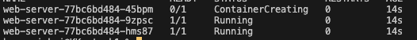
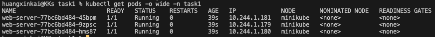
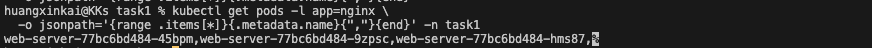
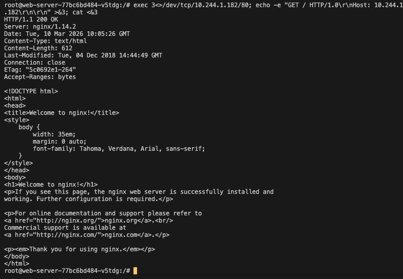
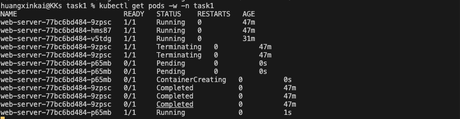
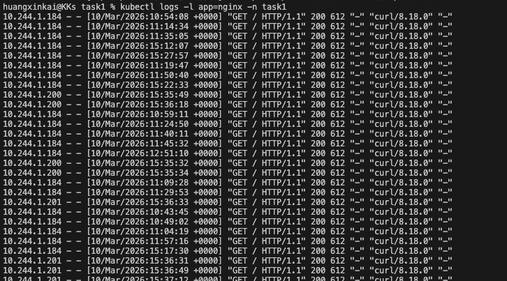
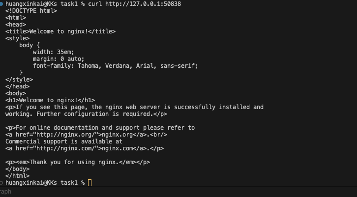
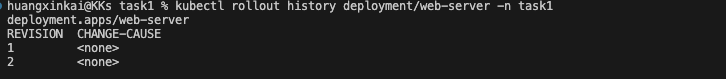
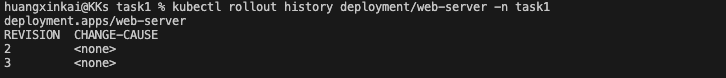
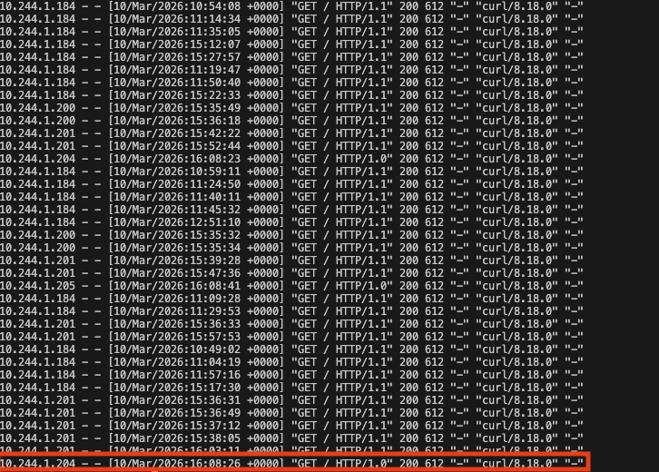

# 任務要求

## 實作題

1.  撰寫一個名為 deployment.yaml 的檔案，並用 kubectl 在本地 cluster 創建以下服務。
    類型： Deployment
    名稱： web-server
    副本數 (Replicas)： 3
    標籤 (Labels)： app: nginx
    映像檔： nginx:1.14.2
    容器埠號： 80

2.  使用 kubectl get pods -o wide 獲得這 3 個 Pod 的 IP 地址。

3.  嘗試用 jsonpath 抓出所有 Label 為 app: nginx 的 pod name，並用逗點分隔。

4.  使用 kubectl exec 進入其中一個 Pod，使用指令驗證網路互通。

進入某一個 Pod後，打同一個 cluster 的 Pod ，輸入`exec 3<>/dev/tcp/<ip>/80; echo -e "GET / HTTP/1.0\r\nHost: <ip>\r\n\r\n" >&3; cat <&3`

5.  手動刪除其中一個 Pod (kubectl delete pod <pod-name>)，觀察 Deployment 如何自動建立新 Pod。

Deployment 有 Rolling Update 的特性，所以會將要刪除的Pod進行處理後，再新增一個 Pod

6.  嘗試創建 service.yaml，套用並建立 service 負責該 pods 的服務轉發，使用 NodePort type 的 Service，創建完成後，嘗試另外創建 pod 去 curl ClusterIp 來驗證該 Service 有正確轉發流量以及觀察 Nginx Pods 上的 logs。

建立service 並且先設定為 NodePort，
並且以`kubectl run curl-test --image=curlimages/curl -it --rm -n task1 -- curl <serice-ip>`為指令，臨時創建一個pod 去打 Nginx Pods
最後再以`kubectl logs -l app=nginx -n task1 `查看 Nginx Pods 上面的流量，確實有被 curl的紀錄

7.  嘗試分別使用 NodePort 及 port forward 的方式，嘗試在本機網路去 curl 該 Service，並且說明兩者的差異以及如果我們希望做到 Service 分流的效果，我們該用兩者之中哪個方法？

使用 NodePort：
建立一個 tunnel，把本機的某個 port 對應到 minikube Node 的 NodePort
`minikube service <service-name> -n task1 --url`
拿到 url後
`curl http://127.0.0.1:xxxxx`

Port Forward 方式：
`kubectl port-forward svc/web-server-service 8080:80 -n task1`
另開 terminal
`curl http://localhost:8080`

如果希望做到 Service 分流 → 用 NodePort
Port Forward 繞過了 Service 的 load balancing，流量只會到固定的一個 Pod，無法分流

8.  嘗試使用 kubectl edit 更新 deployment 後，觀察 pod 的變化，並嘗試使用 rollback 退版及查看版本變化。

將 deployment.yml 進行修改，修改 Nginx image的版本，產生新的版本

退回第1版本
`kubectl rollout undo deployment/<appname> -n task1 --to-revision=1`

第1個版本不見，多了第3個版本

9.  嘗試自己 build 一個新的 nginx image，用它創建一個新的 deployment "web-server-new"，以及與之對應的 service，嘗試在 dockerfile 中，加入 nginx 設定檔的設定，讓其可以將流量轉發至 web-server。
    並且提供您如何驗證是否有成功的做法。

寫一個 Nginx proxy的功能，作為中間代理人將流量轉給原有的 Nginx
新增 nginx.conf，將流量導入另一個 Nginx，並建立新的 Docker image
再此新的 Docker image 建立 deployment 跟 service
從 cluster 內打 web-server-service-new，觀察流量是否經過兩層
`kubectl run curl-test --image=curlimages/curl -it --rm -n task1 -- curl web-server-service-new.task1.svc.cluster.local`
同時看原本 web-server 的 log 有沒有收到請求
`kubectl logs -l app=nginx -n task1`

有多一筆curl的紀錄

10. 第九題流量順序應如以下：
    client -> web-server-service-new -> web-server-new -> web-server-service -> web-server
