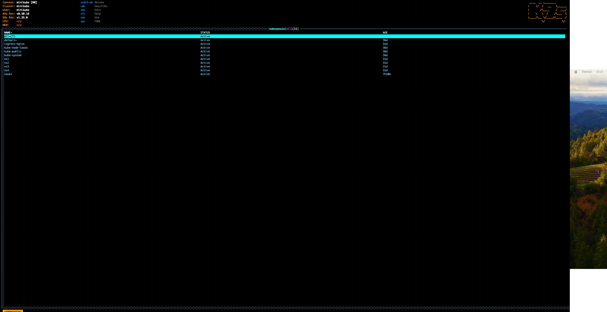
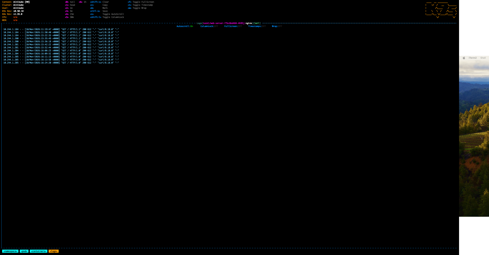
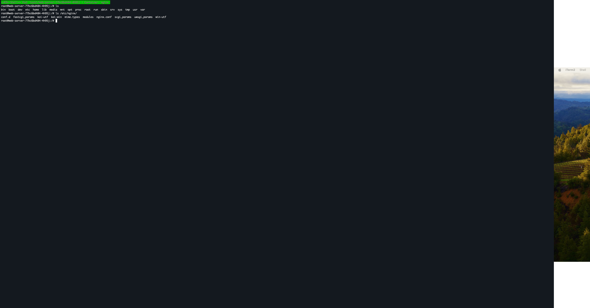
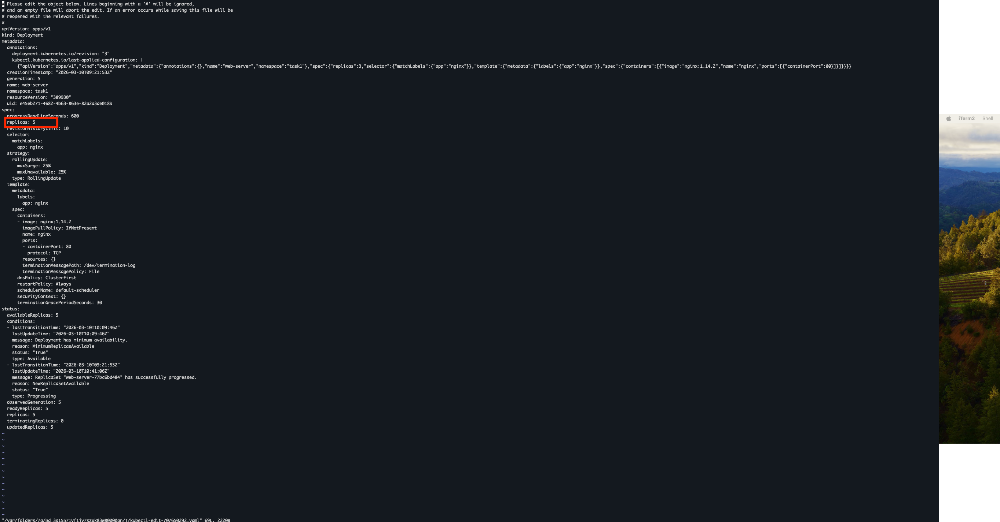
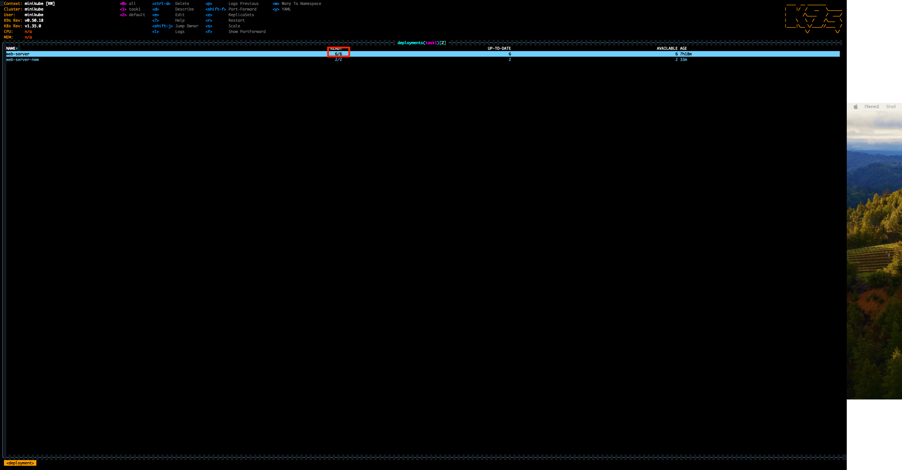
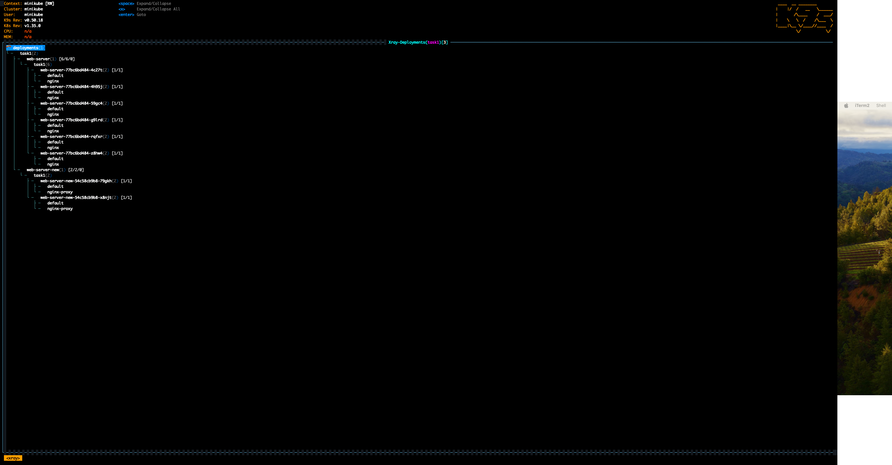

此任務嘗試參加者熟悉 K9s，並根據指令文件學習指令：
https://k9scli.io/topics/commands/

安裝 k9s，並使用 k9s 指令開始使用。

1. 輸入 :ns。

查看 現有Namespace

2. 選擇一個 nginx pod，使用 l 觀察 logs。

查看某一個pod的 logs

3. 使用 s exec 進 shell 查看檔案系統。

4. 使用 e 更新 Nginx deployment 的 replicas。

輸入 :deploy 進入 deployment 列表，
選擇要修改的deployment
原本replicas為5

改成replicas為6

5. 使用 :xray deployment 查看 nginx 資源的關係圖。

