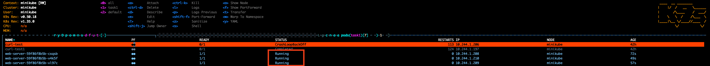
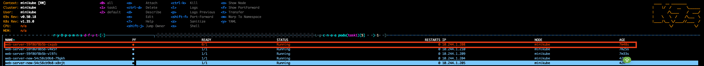
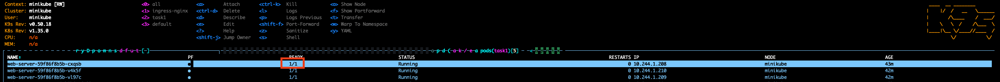

# 任務要求

閱讀服務探針文件，嘗試了解探針(Probe)的原理及功能
https://kubernetes.io/zh-cn/docs/tasks/configure-pod-container/configure-liveness-readiness-startup-probes/

發揮你的創意的時候到了，延續 Task1，對於這個 Nginx Deployment，因為特殊狀況需求，你現在希望可以停止其中一個 Pod 的流量（注意！你並不希望刪除該 Pod 以及關閉該 Pod 上的 Nginx 服務）。

嘗試用 Probe 解決該問題。

# 實作與回答

這裡用 **Readiness Probe** 解決問題。

Readiness Probe 失敗時，Kubernetes 會將 Pod 從 Service 的 Endpoints 移除，流量就不會進來，但 Pod 不會被刪也不會被重啟。這正好符合需求。Liveness Probe 失敗是重啟 Pod，因此不適用。

做法是在 container 裡放一個檔案 `/tmp/ready` 當開關，Readiness Probe 去檢查這個檔案存不存在。Pod 啟動時用 `postStart` lifecycle hook 自動建立這個檔案，讓 Pod 預設是 Ready 的。要停流量時，手動進去把檔案刪掉，Probe 就會失敗，Pod 就從 Endpoints 移除了。

套用 deployment：

```bash
kubectl apply -f deployment.yml
```

確認三個 Pod 都是 1/1 Ready：



停止其中一個 Pod 的流量，把開關檔案刪掉，故意讓該 Pod readiness probe 失敗

```bash
kubectl exec -n task1 <pod-name> -- rm /tmp/ready
```

Probe 失敗後，該 Pod 會變成 0/1 Ready，但還在 Running：



確認 Endpoints 已經移除該 Pod 的 IP：

```bash
kubectl get endpoints web-server-service -n task1
```


要恢復流量，把檔案建回來就好：

```bash
kubectl exec -n task1 <pod-name> -- touch /tmp/ready
```



三個 Pod 都恢復 1/1 Ready

# 整體流程

Pod 啟動
└── postStart: touch /tmp/ready ← 建立開關檔案
└── readinessProbe 每 5 秒 cat 一次
└── 檔案在 → Ready → 收流量
└── 檔案不在 → Not Ready → 不收流量
