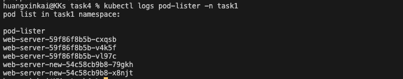
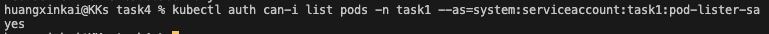
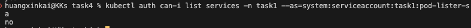

# 任務要求

參考以下文件了解 ServiceAccount 的用途與運作方式：

- https://kubernetes.io/docs/tasks/configure-pod-container/configure-service-account/
- https://kubernetes.io/docs/concepts/security/service-accounts/

使用任何程式語言編寫程式，透過 K8s API 取得特定 namespace 內的 Pod 列表。
將程式打包成 Image 並 push 到 public 的 DockerHub registry。
建立 Pod 使用該 Image，並以 Projected Volume 方式將 SA token 掛載進去。
最終在 Pod log 中能看到類似 `kubectl get pods` 的列表輸出。

# 實作與回答

## 概念

預設 Pod 沒有權限呼叫 K8s API。需要：

1. 建立 ServiceAccount，作為 Pod 的虛擬身份
2. 建立 Role 定義權限（這裡只開放 list pods）
3. 透過 RoleBinding 將 SA 綁到 Role
4. Pod 透過 Projected Volume 拿到 token，用這個 token 打 API

Projected Volume 跟舊的 `automountServiceAccountToken` 比，可以設定 token 有效期跟 audience，安全性較好。

## 檔案說明

- `list_pods.py`：Python 程式，讀取掛載進來的 token 後打 K8s API，印出 pod 列表
- `Dockerfile`：打包 list_pods.py
- `manifest.yml`：SA、Role、RoleBinding、Pod 的 yaml

## 流程

### 1. Build & Push Image

```bash
docker build -t vup4k0806/pod-lister:v1 .
docker push vup4k0806/pod-lister:v1
```

### 2. 套用 manifest

建立 Pod

```bash
kubectl apply -f manifest.yml
```

### 3. 查看 Pod log

```bash
kubectl logs pod-lister -n task1
```



### 4. 驗證 RBAC 權限設定正確

確認 SA 有 list pods 的權限：

```bash
kubectl auth can-i list pods -n task1 --as=system:serviceaccount:task1:pod-lister-sa
```



確認 SA 沒有 list services 的權限（應該回 no）：

```bash
kubectl auth can-i list services -n task1 --as=system:serviceaccount:task1:pod-lister-sa
```



## 整體流程

```
manifest.yml apply
└── SA: pod-lister-sa
└── Role: 允許 get/list pods in task1
└── RoleBinding: 綁 SA 到 Role
└── Pod 啟動
    └── Projected Volume 掛載 token + ca.crt 到 /var/run/secrets/tokens/
    └── list_pods.py 讀 token → 打 K8s API
    └── 印出 task1 namespace 的 pod 列表
```
