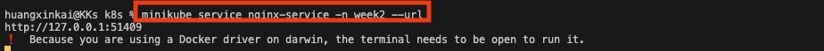
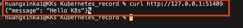
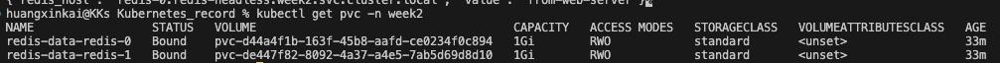
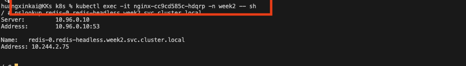
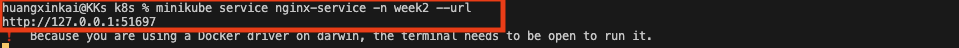
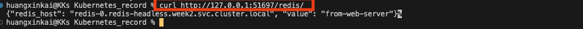

# 任務要求

使用 ConfigMap 掛載 Volume 的方式，將 Nginx 設定檔掛載進 Container 當中，如此一來，你不需要自己 Build image 便可以調整 Nginx 的設定。

請部署一個 Nginx deployment，Nginx 將請求轉發至你自己寫的 Web Service Pod（Deployment）。

另外，使用 Redis Image 部署一個 Redis StatefulSet(2 replicas)，並且掛載 PV 確保其狀態持久性。

您需要驗證你的 Web Service 能夠使用 Headless Service 連線到 Redis 上（例如 redis-0 pod），並存取資料。

你可以嘗試在 Cluster 內做 DNS 解析的測試，說明你要怎麼確保你可以存取第一個 Pod，以及 Headless 跟 ClusterIP 有何差別，請說明。

嘗試使用 Secret 定義 redis 使用者資料，讓 Web Service Pod 可以透過掛載 ENV 去取得連線資訊。

# 實作與回答

## 任務架構圖

```

外部流量
    │
    ▼
┌─────────────────────────────────┐
│  Nginx Deployment               │
│  (nginx pod)                    │◄── ConfigMap
│  nginx.conf 透過 Volume 掛載     │    (nginx.conf 內容)
└──────────────┬──────────────────┘
               │ proxy_pass to web-service
               ▼
┌─────────────────────────────────┐
│  Web Service Deployment         │
│  (app pod)                      │◄── Secret
│  ENV: REDIS_HOST, REDIS_PASS    │    (redis 帳號密碼)
└──────────────┬──────────────────┘
               │ 連線 redis-0.redis-headless
               ▼
┌─────────────────────────────────┐
│  Redis StatefulSet              │
│  ┌──────────┐  ┌──────────┐    │
│  │ redis-0  │  │ redis-1  │    │◄── Headless Service
│  │  PVC/PV  │  │  PVC/PV  │    │    (穩定 DNS 名稱)
│  └──────────┘  └──────────┘    │
└─────────────────────────────────┘
```

## 需要建立的相關檔案

- `Dockerfile` + Web Server 程式碼 → build & push image
- `ConfigMap` — 存 nginx.conf 內容
- `Deployment` — web-server
- `Service` — web-server-service（ClusterIP，給 Nginx proxy_pass 用）
- `Deployment` — nginx（掛載 ConfigMap 為 Volume）
- `Service` — nginx-service（NodePort，對外暴露）
- `Secret` — redis-secret（存放 Redis 連線資訊）
- `StatefulSet` — redis（2 replicas，掛載 PVC）
- `Service` — redis-headless（Headless Service，clusterIP: None）

## 流程

1. 使用 Python Django 撰寫一個 web-server，並用 Docker 執行容器化，推上 Docker Hub

2. 啟動兩個 Deployment，一個是 web-server，使用推上 Docker Hub 的 image；另一個則是 Nginx，透過 ConfigMap 將 nginx.conf 掛載為 Volume，讓 Nginx 作為反向代理，將流量導入 web-server




Response 為 Hello K8s，確認流量有經過Nginx 再導到 web-server

3. 建立 Redis StatefulSet（2 replicas），image 為 `redis:7-alpine`，並使用 Headless Service（clusterIP: None），每個 pod 透過 `volumeClaimTemplates` 自動建立 PVC，確保資料持久性

```bash
kubectl get pvc -n week2
```



4. 將 Redis 連線資訊（REDIS_HOST、REDIS_PORT、REDIS_PASSWORD）寫成 Secret，使用 `stringData` 欄位（機敏資訊應改成 Data，再以 base64加密 ）

5. 在 web-server Deployment 中透過 `envFrom.secretRef` 將 redis-secret 注入為環境變數，pod 啟動後可直接使用 `os.environ.get('REDIS_HOST')` 取得連線資訊

6. 驗證 DNS 解析：進入 web-server pod 內部執行 nslookup

```bash
kubectl exec -it <web-server-pod-name> -n week2 -- sh
nslookup redis-0.redis-headless.week2.svc.cluster.local
```



7. 驗證整條鏈路：透過 nginx-service 打 `/redis/` endpoint

```bash
minikube service nginx-service -n week2 --url
curl http://127.0.0.1:<port>/redis/
# 回傳 {"redis_host": "redis-0.redis-headless.week2.svc.cluster.local", "value": "from-web-server"}
```




curl → Nginx → web-server → redis-0（Headless DNS）→ 寫入/讀取成功

## Headless Service vs ClusterIP 差別

|                  | ClusterIP                                    | Headless Service                       |
| ---------------- | -------------------------------------------- | -------------------------------------- |
| clusterIP        | 有虛擬 IP（e.g. 10.96.x.x）                  | None                                   |
| DNS 解析         | 解析到虛擬 IP，由 kube-proxy 做 load balance | 直接解析到 pod IP                      |
| 能否指定特定 pod | 不行                                         | 可以，透過 `<pod-name>.<service-name>` |
| 適合場景         | 無狀態服務（不在意打到哪個 pod）             | 有狀態服務（需要連到特定 pod）         |

StatefulSet 搭配 Headless Service，每個 pod 會取得固定 DNS 名稱：

```
redis-0.redis-headless.week2.svc.cluster.local  → 直接解析到 redis-0 的 pod IP
redis-1.redis-headless.week2.svc.cluster.local  → 直接解析到 redis-1 的 pod IP
```

Redis 的 master 通常是 `redis-0`，需要能精準指定，所以必須用 Headless Service 而非 ClusterIP。
