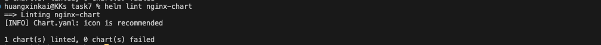
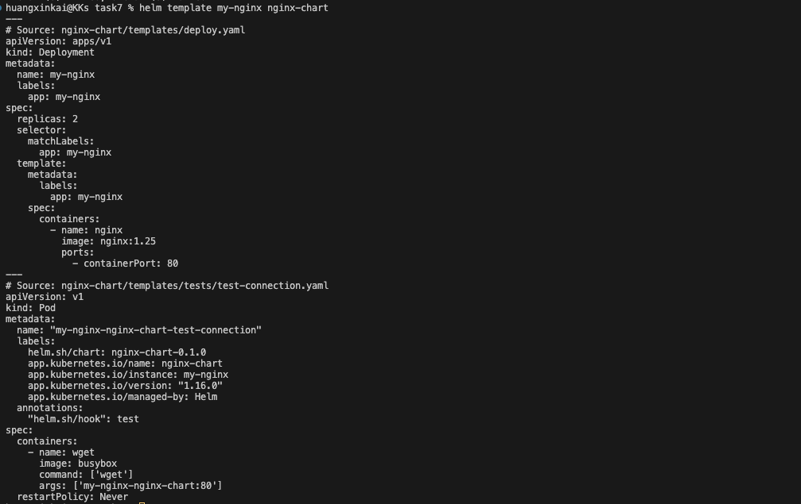
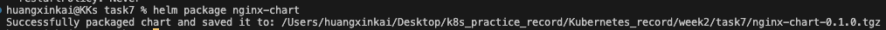
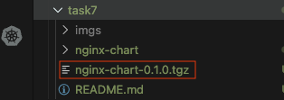
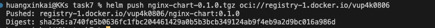
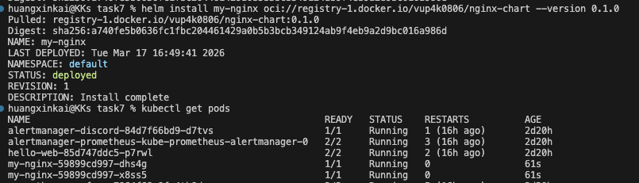

# 任務要求

嘗試閱讀 https://helm.sh/docs/chart_template_guide/getting_started，以瞭解 Helm Chart 開發方式。

創建一個自己的 Helm Chart，至少需要有 /templates 及 values.yaml（可以簡單的創建一個 nginx deployment，values.yaml 可以放 replicas）。

請選擇任一個 hosted helm registry，
https://helm.sh/docs/topics/registries#use-hosted-registries
將你的 helm chart push 到該 registry 上，並以 public 存取的方式，在你的 local k8s 環境上 install 該 chart。

# 實作與回答

## 任務架構圖

1. 創建一個新的 Helm Chart

```bash
helm create nginx-chart
```

2. 創建 `values.yaml` 與 `templates/` 底下的模板，values提供的是相關的值
   例如 replicaCount 的數量、Pod 建立 container時使用的 image 內容版本，以及 使用的 Port號

3. 語法檢查

輸入

```bash
helm lint nginx-chart
```



4. 查看 values 渲染至 template的結果

```bash
helm template my-nginx nginx-chart
```



5. 先更新 Helm Chart repo，取得最新的 index.yaml

```bash
helm repo update
```

6. 把 chart 打包成 .tgz：

```bash
helm package nginx-chart
```




會產生 nginx-chart-0.1.0.tgz（版本號來自 Chart.yaml）

7. 登入你所要推上的儲存庫，這裏使用 Docker Hub，因此需要輸入你的 Docker Hub的帳號，後續會要求輸入密碼

```bash
helm registry login registry-1.docker.io -u <你的 Docker Hub username>
```

8. 輸入密碼後即可推上 Docker Hub

```bash
helm push nginx-chart-0.1.0.tgz oci://registry-1.docker.io/<username>
```



```bash
Pushed: registry-1.docker.io/vup4k0806/nginx-chart:0.1.0
Digest: sha256:a740fe5b0636fc1fbc204461429a0b5b3bcb349124ab9f4eb9a2d9bc016a986d
```

9. helm install

```bash
helm install my-nginx oci://registry-1.docker.io/vup4k0806/nginx-chart --version 0.1.0
```

因為我們在 template 的 {{ .Release.Name }}，可以根據我們需求賦予名稱

```bash
helm install <新名稱> oci://registry-1.docker.io/vup4k0806/nginx-chart --version 0.1.0
```


