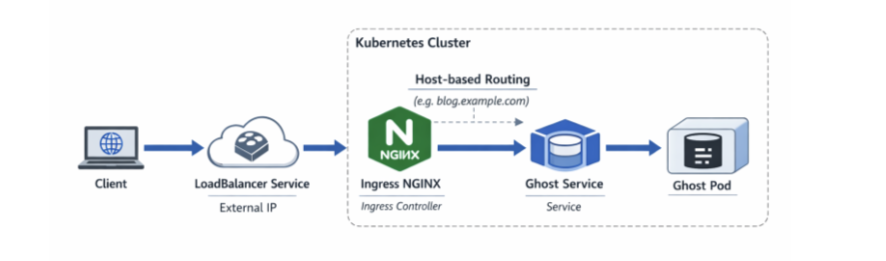
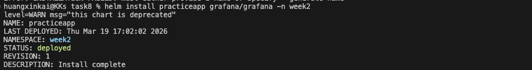
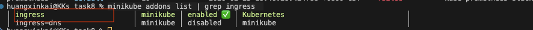
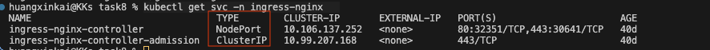
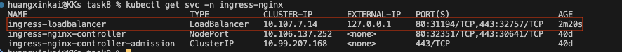
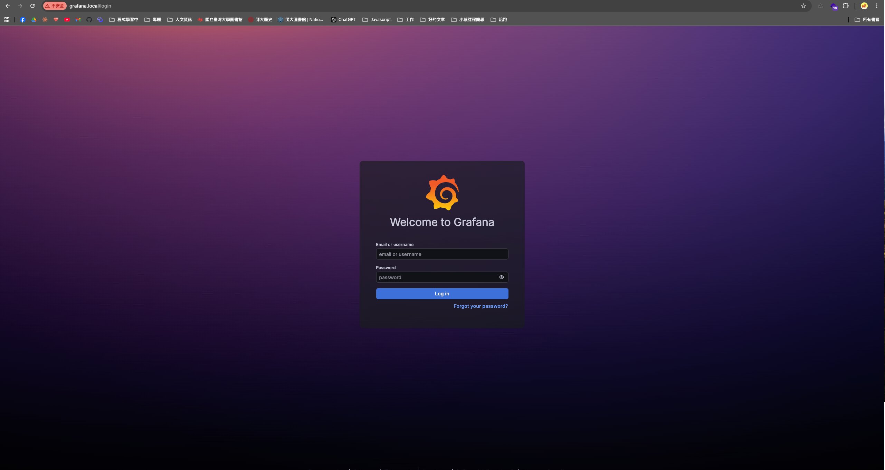

# 任務要求

嘗試使用 Helm Chart 安裝任一開源服務，例如：
https://artifacthub.io/packages/helm/bitnami/ghost

並且，使用 Nginx Ingress（https://github.com/kubernetes/ingress-nginx），作為 Ingress 將外部流量導向該開源服務。

該 ingress 需根據 hostname(網址) 作為規則，去轉發該流量（可使用 Host Header 去驗證請求）。

並且你可以創建 Loadbalancer Service 允許外部流量進入 Ingress，流量路徑如下（亦可參考下圖）：
Client -> loadbalancer(created by "loadbalancer service") -> ClusterIP of "loadbalancer service" -> Service of Ingress -> Pods of Ingress(Nginx) -> Ghost Service -> Ghost Pod

（進階題）嘗試使用 Gateway API 取代 Ingress，Gateway API 實作部分，可以參考https://gateway.envoyproxy.io/



# 實作與回答

## 實作步驟

1. 安裝 grafana ， 透過 helm chart

```bash
helm repo add grafana https://grafana.github.io/helm-charts
```

```bash
helm install <name> grafana/grafana -n week2
```



2. 安裝 ingress-nginx

```bash
helm repo add ingress-nginx https://kubernetes.github.io/ingress-nginx
```

```bash
helm install ingress-nginx ingress-nginx/ingress-nginx -n week2
```

如果在本機使用 `minikube`的話，已經有安裝 `nginx-ingress`，輸入列出所有 minikube 可用的 addon

```bash
minikube addons list | grep ingress
```



這裡的 `Nginx-ingress`是 `Cluster`層級，所以不論是在不同 `namespace`都可以被處理
minikube addon 幫你裝好了 ingress-nginx controller

3. 設置 Ingress

Ingress 資源 → nginx 自動讀取 → 依規則轉發流量 → 將流量轉移至設定的 pod(前面設定的 pod:practiceapp-grafana)
新增`ingress.yaml`，並撰寫相關設定

```bash
kubectl get ingress -n week2
```


查看 ingress 設定是否完整無誤

4. 查看 Nginx-ingress service 的設置

```bash
kubectl get svc -n ingress-nginx
```

為什麼這裡有一個 namespace 為 ingress-nginx？
此為 minikube 啟用 ingress addon 時，自動建立 ingress-nginx namespace



可以看到 TYPE 為 `NodePort`，因此要另外建立一個 LoadBalancer Service 指向 ingress-nginx pods

5. 建立一個 service TYPE 為 `loadbalancer`，selector 要指向 `app.kubernetes.io/name: ingress-nginx` ingress-nginx Pod

並開啟 minikube tunnel

```bash
minikube tunnel
```



6. 設定 /etc/hosts

將 grafana.local 在本機解析為 127.0.0.1，因為本機沒有真實 DNS，需手動設定

```bash
echo "127.0.0.1  grafana.local" | sudo tee -a /etc/hosts
```

7.  測試流量是否有打通

網址 或者 curl

```
網址輸入
grafana.local
```

```bash
curl -H "Host: grafana.local" http://127.0.0.1
```



## 整體的流量路線

Client
瀏覽器輸入 grafana.local
→ /etc/hosts 解析成 127.0.0.1
→ LoadBalancer Service (127.0.0.1:80, ingress-nginx namespace)
→ ingress-nginx Pod（讀 Ingress 規則：grafana.local → practiceapp-grafana）
→ practiceapp-grafana Service (week2 namespace, ClusterIP)
→ Grafana Pod
