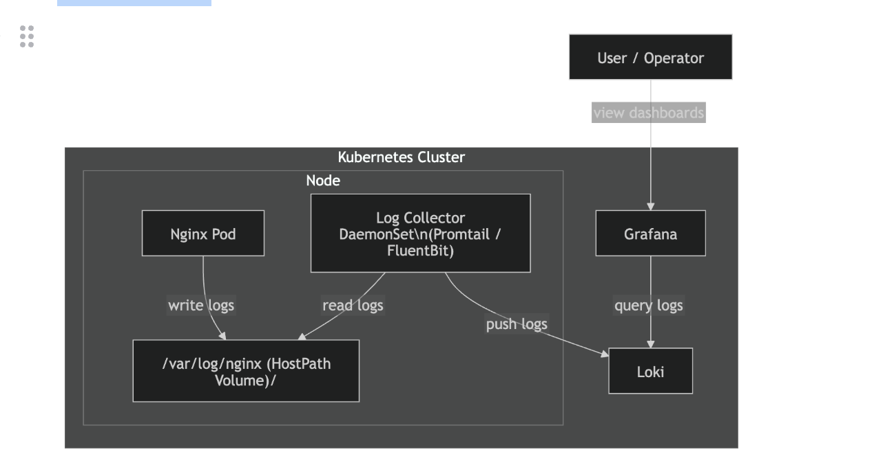
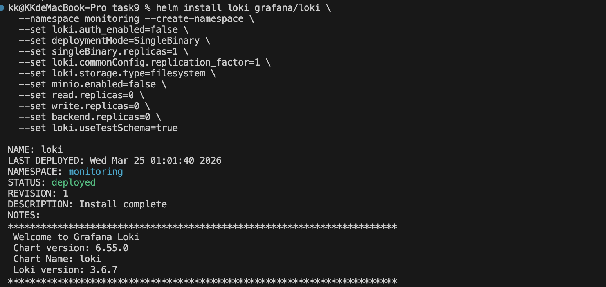
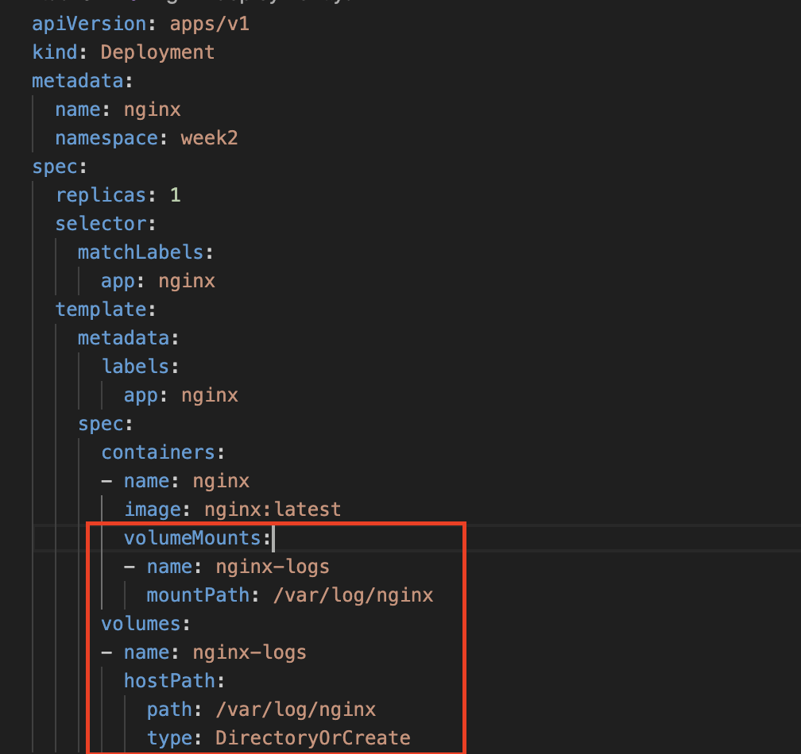
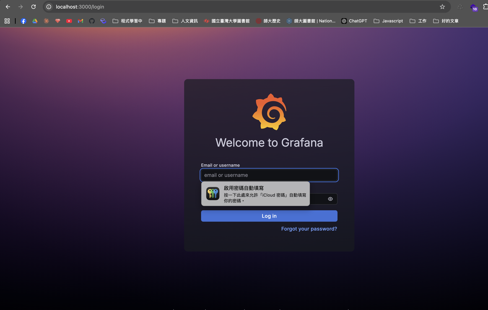
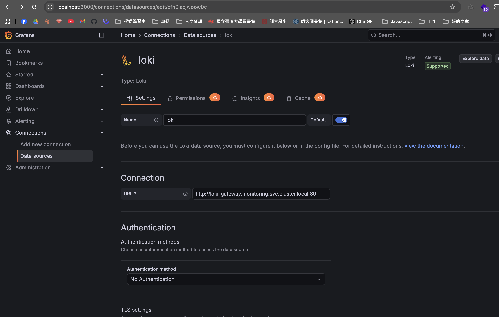
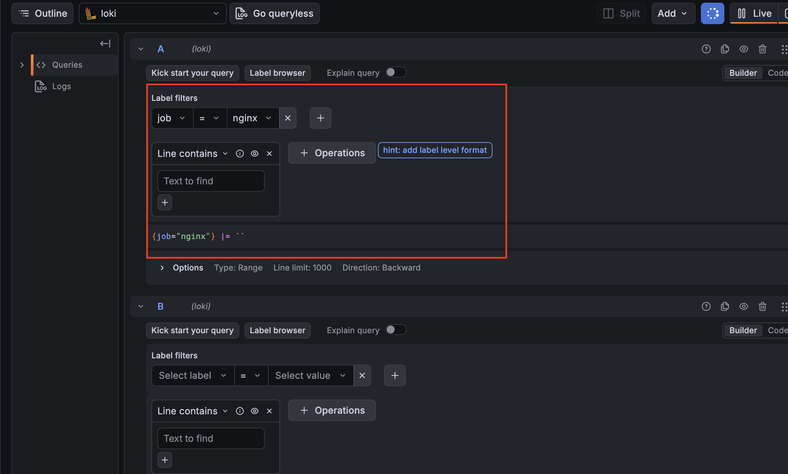
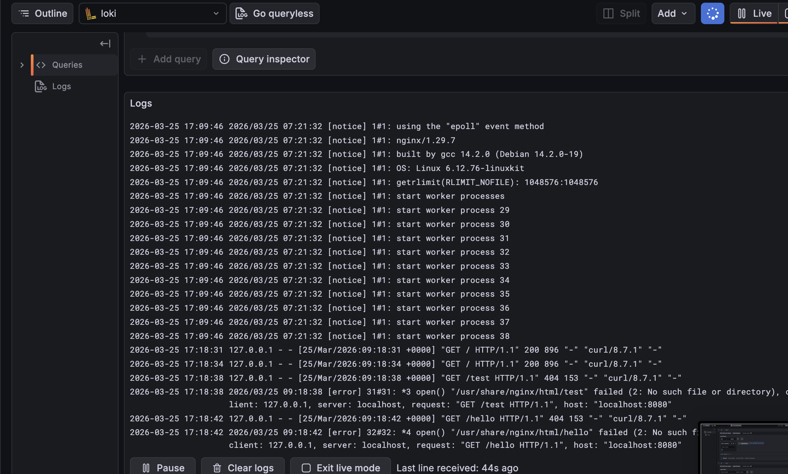

# 任務要求

嘗試根據此教學（https://grafana.com/docs/loki/latest/setup/install/helm/install-monolithic/）
使用 Helm 安裝 Loki 及 Grafana（不一定要 monolithic 也沒關係，但 monolithic 應該提供了驗證可行性的最簡單方式，應該足以完成這一題的要求），

完成後，我們現在應該有 Loki（日誌儲存與查詢工具）跟 Grafana（圖像化的監控介面）

請部署一個 Nginx Deployment/Pod，將 log 存到 HostPath，

並且以 DaemonSet 的方式，部署任一個日誌搜集工具（例如 fluentd, fluentbit, promtail, logstash 等），抓取該 hostpath，將 Log 上報到 Loki。

此題概念圖如下：


# 實作回答

## 實作步驟

1. 透過 helm chart 安裝 loki & grafana
```bash
helm repo add grafana https://grafana.github.io/helm-charts
```

```bash
helm repo update
```

```bash
# 根據自己的需求與 helm 提供的 values.yaml 進行設定
helm install loki grafana/loki \
  --namespace monitoring --create-namespace \
  --set loki.auth_enabled=false \
  --set deploymentMode=SingleBinary \
  --set singleBinary.replicas=1 \
  --set loki.commonConfig.replication_factor=1 \
  --set loki.storage.type=filesystem \
  --set minio.enabled=false \
  --set read.replicas=0 \
  --set write.replicas=0 \
  --set backend.replicas=0 \
  --set loki.useTestSchema=true
```

```bash
helm install grafana grafana/grafana \
  --namespace monitoring \
  --set adminPassword={password} \
  --set service.type=NodePort
```



2. 部署一個 Nginx Deployment/Pod，將 log 存到 HostPath，避免 該 Pod 掛掉後資料不見，後續部署 DaemonSet 時，將 promtail 指向該 log 檔案，抓取資料




3. 部署 Promtail DaemonSet 作為 log 搜集工具，將 log 推送到 Loki，設定檔為 ```promtail-daemonset.yaml```
在```promtail-daemonset.yaml```裡有以下設定
DaemonSet    → 在每個 Node 跑一個 Promtail Pod
ConfigMap    → Promtail 的設定檔（要讀哪裡、推去哪裡）
ServiceAccount + ClusterRole + ClusterRoleBinding → 給 Promtail 權限


確保部署的 Nginx、Grafana、Loki 以及 DaemonSet的 Promtail Pod 都有跑起來

4. 暫時打通 Grafana
```bash
kubectl port-forward svc/grafana 3000:80 -n monitoring
```


5. 暫時打通部署的 Nginx
```bash
kubectl port-forward svc/nginx 8080:80 -n week2
```

並且透過 
```bash
curl http://localhost:8080
``` 
產生一些 log

6. 登入 Grafana 進行設定，Resource 增加 loki，加入 URL 與要抓 log 的 app



resource 加入 loki

抓取 job為 nginx的log資料



7. 若不想手動操作，可以建立 ```grafana-values.yaml```，對照 helm chart 提供的 template values 進行設定，讓 Grafana 啟動時自動加入 Loki data source

8. 建立 secret，將密碼存進 k8s，避免明碼寫在 values 檔案中
```bash
kubectl create secret generic grafana-admin \
  --from-literal=admin-user=admin \
  --from-literal=admin-password={password} \
  --namespace monitoring
```

9. 透過 helm upgrade 套用新設定，Grafana Pod 重啟後自動完成 Loki data source 設定
```bash
helm upgrade grafana grafana/grafana \
  --namespace monitoring \
  -f grafana-values.yaml
```

## 流程
```
Nginx Pod → /var/log/nginx (HostPath) → Promtail DaemonSet → Loki → Grafana
```
