# 任務要求

1. 嘗試在 K8s 部署 Gitlab，並測試將 local repo 推上去成功。
2. 嘗試部署 ArgoCD，在 Gitlab 中新增一個 Repo，用以存放你要部署的 Helm，將 Task6 的作業成品透過 Argocd 部署上去。並且嘗試 Argocd 上的相關部署設定。（如果是 Helm，可嘗試將 Chart 推到 harbor [https://github.com/goharbor/harbor] 上）
3. 嘗試手動使用 ArgoCD 部署第三方 Helm Chart 服務。
4. 嘗試將 2 & 3 創建出來的兩個 Applications，改成用 YAML（Custom Resource） 管理。
5. （進階題）承 4，近一步考慮 App of Apps [https://argo-cd.readthedocs.io/en/stable/operator-manual/cluster-bootstrapping/#app-of-apps-pattern] 的方式進行管理。

# 實作回答

## 實作步驟
1. 創建 Namespace(可做可不做)
```bash
kubectl create namespace gitlab
kubectl create namespace argocd
kubectl create namespace task10
```

2. 需要先在 本機 minikube 安裝 ```Gitlab```，為的是後續 ArgoCD 追蹤的標的

```bash
helm repo add gitlab https://charts.gitlab.io/
```

```bash
helm repo update
```

```bash
helm install gitlab gitlab/gitlab \
  -n gitlab \
  --set global.hosts.domain=127.0.0.1.nip.io \
  --set global.edition=ce \
  --set certmanager-issuer.install=false \
  --set global.ingress.configureCertmanager=false \
  --set gitlab-runner.install=false \
  --set prometheus.install=false \
  --set global.ingress.class=nginx
```

不確定 helm 的 values要填入哪些時，可以先下該指令進行查詢
```bash
helm show values gitlab/gitlab > gitlab-values.yaml
```

可能要避免的坑：在 macOS Docker driver 下，`minikube ip`（e.g. `192.168.49.2`）從 host 無法直接連到，因此 domain 必須使用 `127.0.0.1.nip.io`，讓 DNS 解析到 `127.0.0.1`。


3. 使用 ```kubectl port-forward``` 進行轉發

在 macOS Docker driver 上，有兩種方式可以連到 GitLab：

| 方式 | 說明 |
|------|------|
| `minikube tunnel` | 讓 LoadBalancer Service 拿到外部 IP，走完整的 LoadBalancer → Ingress 路徑，但 macOS 上 port 80/443 需要 root 權限，實際上無法直接連線 |
| `kubectl port-forward` | 直接將 Mac 本機 port 接到 K8s Service，繞過 LoadBalancer，是 macOS 上最簡單直接的解法 |

因此採用 `kubectl port-forward`，**不需要另外開** `minikube tunnel`。

GitLab 預設會將所有 HTTP 請求強制 redirect 到 HTTPS（308），因此要 port-forward HTTPS 的 port：
```bash
kubectl port-forward svc/gitlab-nginx-ingress-controller 8443:443 -n gitlab
```

打開瀏覽器輸入 ```https://gitlab.127.0.0.1.nip.io:8443```

會出現自簽憑證警告，點「進階」→「繼續前往」即可。
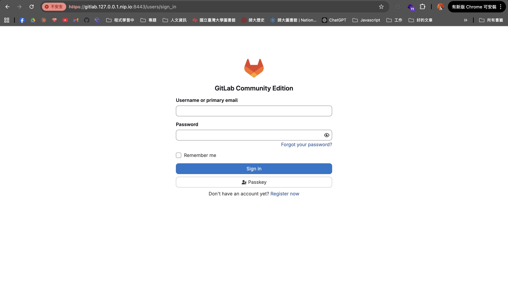


4. 取得 ```Gitlab```的密碼
```bash
kubectl get secret gitlab-gitlab-initial-root-password \
  -n gitlab -o jsonpath='{.data.password}' | base64 -d
```

成功登入 ```Gitlab```
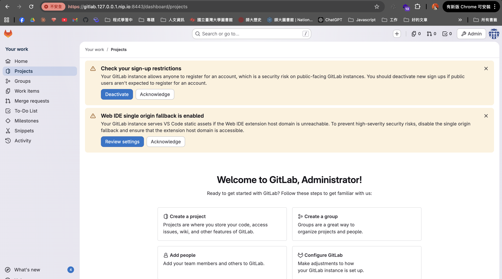

5. 在 local 推一個 repo上去

先在```Gitlab```創建一個 repo
再創建要 push上去的資料夾
```bash
mkdir k8s_task10 && cd k8s_task10
```

git push 的 url

```bash
git remote add origin https://gitlab.127.0.0.1.nip.io:8443/root/K8s_task10.git

```

fatal: unable to access 'https://gitlab.127.0.0.1.nip.io:8443/root/k8s_task10.git/': SSL certificate problem: unable to get local issuer certificate

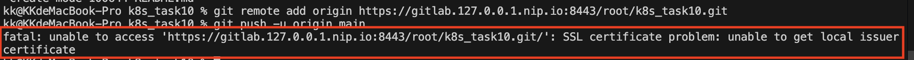

暫時關掉憑證
```bash
git config --global http.sslVerify false
```

建立簡單的資料推上 local repo，並且帶上 push url 跟密碼
```bash
git push https://root:$(kubectl get secret gitlab-gitlab-initial-root-password -n gitlab -o jsonpath='{.data.password}' | base64 -d)@gitlab.127.0.0.1.nip.io:8443/root/k8s_task10.git main
```

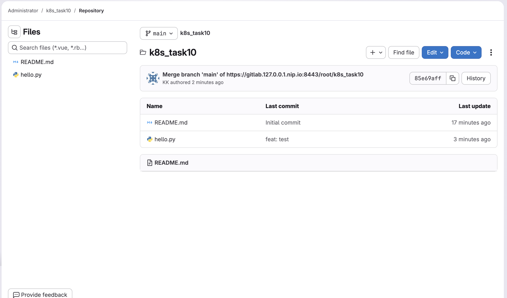

------

6. 使用 ```helm create```建立 helm 模板
```bash
helm create task6-chart
```

7. 把 task6 的 k8s yaml 搬進 templates/，加上 values.yaml 參數化
```
task6-chart/
├── Chart.yaml
├── values.yaml
└── templates/
    ├── configmap.yaml
    ├── nginx.yaml
    ├── redis-secret.yaml
    ├── redis.yaml
    └── web-server.yaml
```

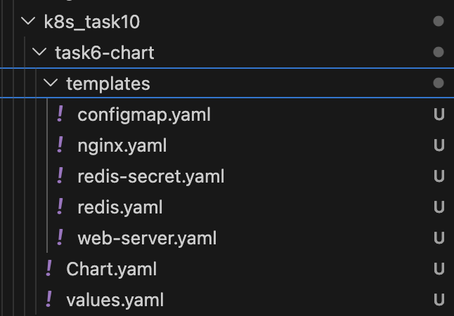

8. 使用 ```helm lint task6-chart``` 進行語法檢查

輸入```helm template task6 task6-chart``` 進行渲染

9. 打包 ```helm package task6-chart```

------

10. 安裝 ```harbor```，並且加入 harbor 的 helm repo
```bash
helm repo add harbor https://helm.goharbor.io
```

```bash
helm repo update
```

同時建立一個 namespace
```bash
kubectl create namespace harbor
```

```bash
helm install harbor harbor/harbor \
  --namespace harbor \
  --set expose.type=nodePort \
  --set expose.tls.auto.commonName=harbor.127.0.0.1.nip.io \
  --set externalURL=https://harbor.127.0.0.1.nip.io:30003 \
  --set expose.nodePort.ports.https.nodePort=30003 \
  --set persistence.enabled=false
```

暫時使用 port-forward
```bash
kubectl port-forward svc/harbor -n harbor 30003:443
```

瀏覽器輸入 ```https://127.0.0.1:30003```

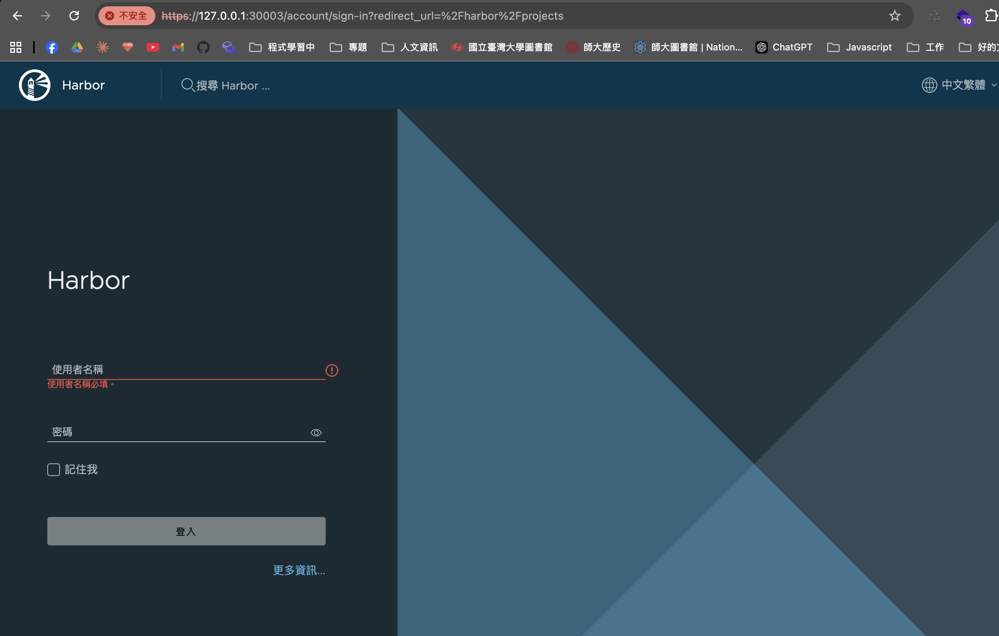

- 帳號：`admin`
- 密碼：`Harbor12345`

helm 登入 harbor
```bash 
helm registry login harbor.127.0.0.1.nip.io:30003 \
  --username admin \
  --password Harbor12345 \
  --insecure
```
切到 打包好的 package 
推上harbor
```bash
helm push task6-chart-0.1.0.tgz \
  oci://harbor.127.0.0.1.nip.io:30003/library \
  --insecure-skip-tls-verify
```

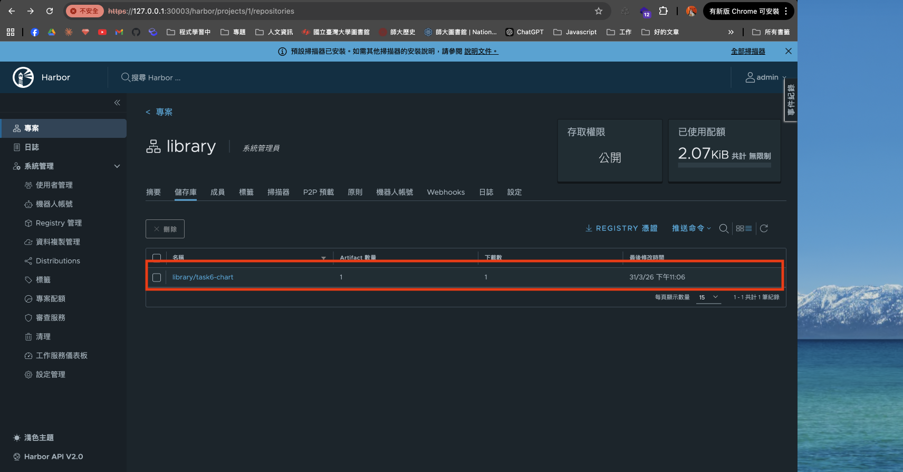

-----

11. 安裝 ArgoCD
```bash
kubectl create namespace argocd
```

```bash
kubectl apply -n argocd \
  -f https://raw.githubusercontent.com/argoproj/argo-cd/stable/manifests/install.yaml \
  --server-side
```

等 pod 跑完後，即可登入 ArgoCD

依舊以 port-forward開啟
```bash
kubectl port-forward svc/argocd-server -n argocd 8080:443 --address 0.0.0.0
```

取得密碼
```bash
kubectl get secret argocd-initial-admin-secret \
  -n argocd \
  -o jsonpath="{.data.password}" | base64 -d && echo
```

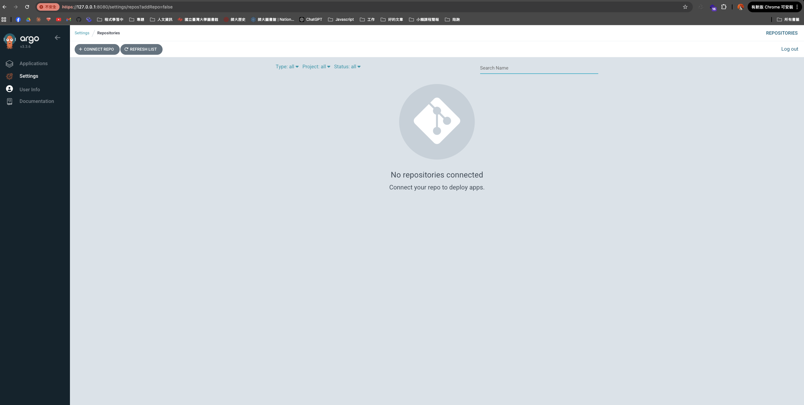

將 ```task6-chart``` 推上 ```Gitlab```

```bash
git remote add gitlab https://gitlab.127.0.0.1.nip.io:8443/root/k8s_task10.git

```

```bash
git push https://root:$(kubectl get secret gitlab-gitlab-initial-root-password \
  -n gitlab -o jsonpath='{.data.password}' | base64 -d)@gitlab.127.0.0.1.nip.io:8443/root/k8s_task10.git main --force
```
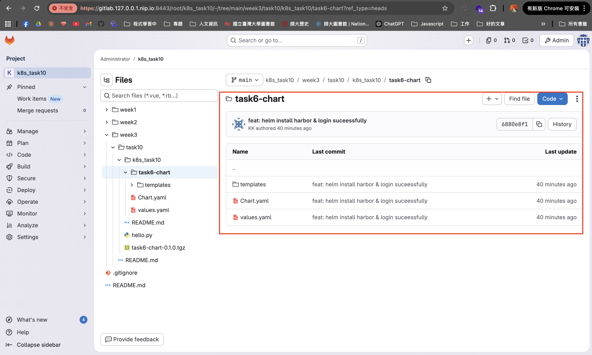


12. ArgoCD設定，允許透過git 進行連接，同時向 ```Gitlab```申請 access token，並且填入帳號及 access token

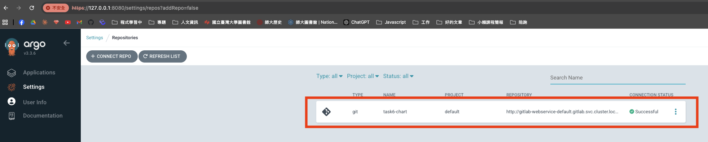

13. 在 ArgoCD 新增一個 Applications，指向 ```Gitlab``` repo，


 **+ NEW APP**，填入：

| 欄位 | 值 |
|------|----|
| Application Name | `task` |
| Project | `default` |
| Sync Policy | `Automatic` 或 `Manual` |
| Repository URL | 你的 Git repo，http://gitlab-webservice-default.gitlab.svc.cluster.local:8181/root/k8s_task10.git|
| Revision | `HEAD` 或 branch name |
| Path | `.`（repo 根目錄就是 yaml 所在位置） |
| Cluster URL | `https://kubernetes.default.svc`（本機叢集） |
| Namespace | `default` 或自訂 |

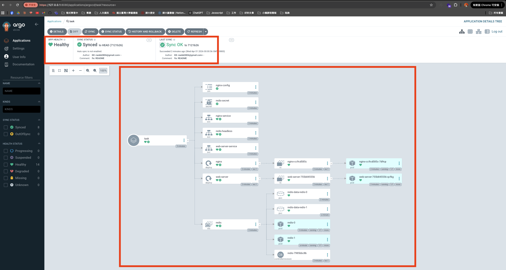

Namespace 選擇 task10，透過 ArgoCD，該 Namespace 確實建立相對應的 pods
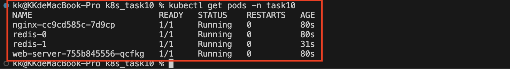

14. 透過 IaC 管理 ArgoCD Application（任務要求 4）

ArgoCD 的 Application 本身就是一種 CRD，UI 建立的 Application 背後就是一份 YAML，可以透過 `kubectl apply` 管理，不需要進 UI 操作。

先查詢目前 ArgoCD 管理的 Application：
```bash
kubectl get application -n argocd
```
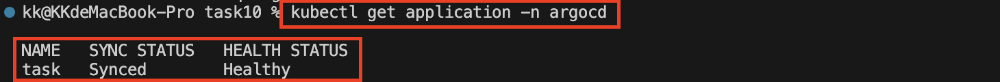

將 Application 匯出成 YAML：
```bash
kubectl get application task -n argocd -o yaml > app-task.yaml
```

匯出的 YAML 包含許多 k8s 自動產生的欄位（uid、resourceVersion、status 等），整理後只保留核心內容，存為 `app-task.yaml`：
```yaml
apiVersion: argoproj.io/v1alpha1
kind: Application
metadata:
  name: task
  namespace: argocd
spec:
  project: default
  source:
    repoURL: http://gitlab-webservice-default.gitlab.svc.cluster.local:8181/root/k8s_task10.git
    targetRevision: HEAD
    path: week3/task10/k8s_task10/task6-chart
  destination:
    server: https://kubernetes.default.svc
    namespace: task10
  syncPolicy:
    automated:
      prune: true
      selfHeal: true
```

套用 YAML，之後所有變更都透過此檔案管理：
```bash
kubectl apply -f app-task.yaml
```
--------

遇到問題

在安裝 Gitlab 時，有一個 pod一直裝不起來

查看原因

```bash
kubectl describe pod gitlab-webservice-default-758f497bcf-6t7jv -n gitlab
```

一開始給的 ```minikube```的資源太少
因此這裡的解決方式是，重新安裝 ```minikube```，並提供其資源
```bash
minikube delete
minikube start --memory=10240 --cpus=4
```