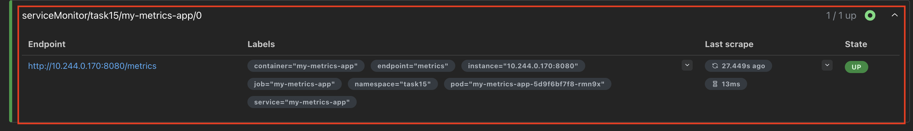
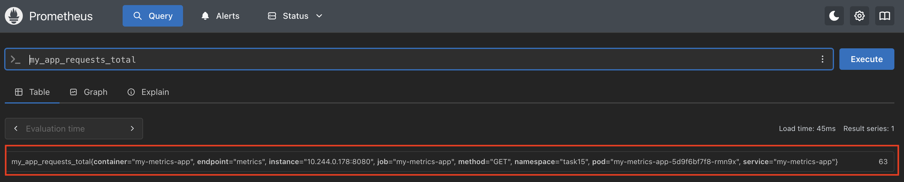
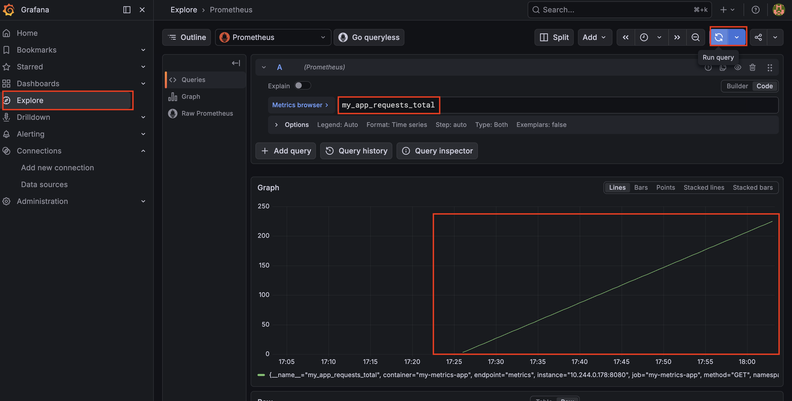
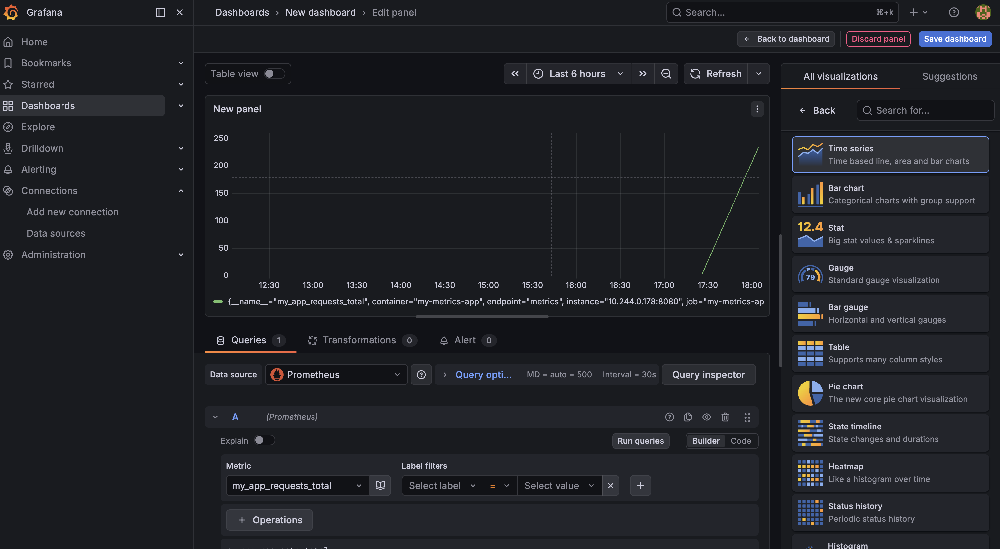
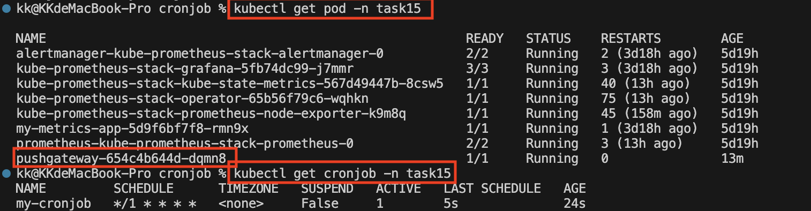
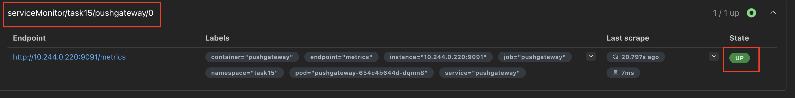
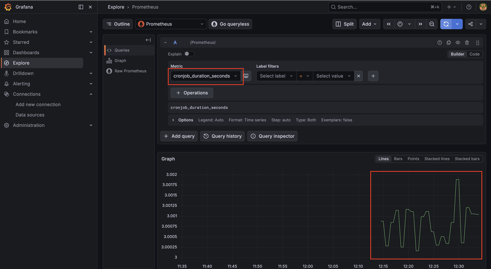
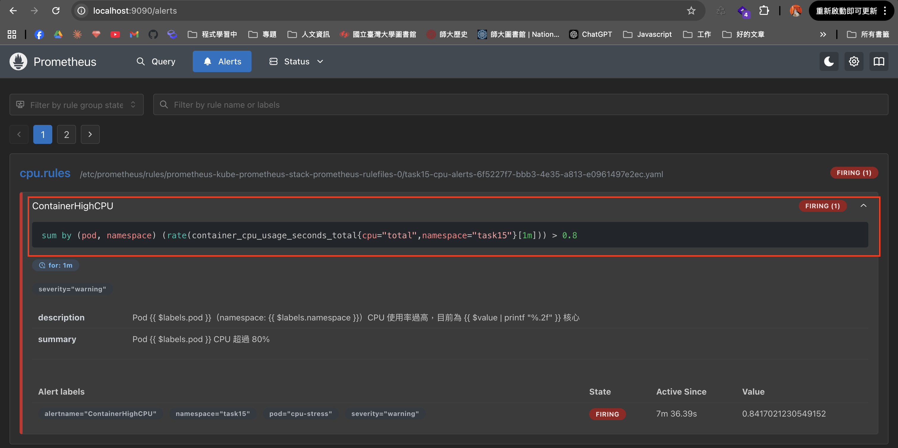
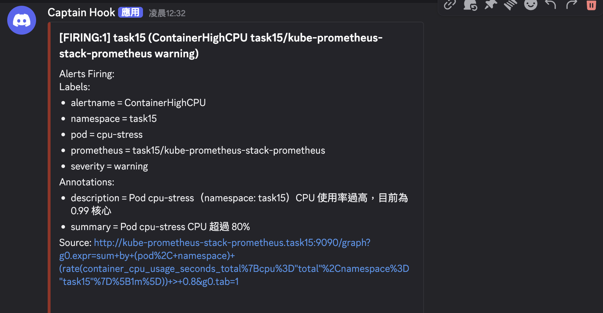

# 任務要求

1. 使用 [kube-prometheus-stack](https://github.com/prometheus-community/helm-charts/blob/main/charts/kube-prometheus-stack/README.md) Helm Chart，在 K8s 中安裝 Prometheus 與 Grafana。
2. 使用 Prometheus SDK（任何語言），在自己的 image 中加入 `/metrics` endpoint，並暴露任何一個 custom metrics。
3. 在 Grafana 與 Prometheus 後台分別查看 Custom Metrics。
4. 創建 K8s CronJob 運行自己 Build 的 image，說明非常駐行程情況下 Prometheus 如何獲取 metrics（例如執行 duration）。
5. 創建 Alert，在 Container CPU 達 80% 時發送訊息至 Discord。
6. 總結以上，使用 Prometheus Operator（CRD）完成所有設定。

# 實作回答

## 資料夾結構與檔案用途

```
task15/
├── app.py                              # 常駐 metrics app（Prometheus SDK）
├── Dockerfile                          # 打包 app.py 的 Docker image
├── monitor/
│   ├── deployment.yaml                 # [Deployment + Service] 部署 metrics app
│   └── service-monitor.yaml           # [CRD] ServiceMonitor：讓 Prometheus 自動 scrape metrics app
├── cronjob/
│   ├── app.py                          # 非常駐 CronJob app，執行後推 metrics 到 Pushgateway
│   ├── Dockerfile                      # 打包 cronjob app.py 的 Docker image
│   ├── cronjob.yaml                    # [CronJob] 每分鐘執行一次 cronjob app
│   ├── pushgateway.yaml               # [Deployment + Service] Pushgateway 中間站
│   ├── service-monitor.yaml           # [CRD] ServiceMonitor：讓 Prometheus scrape Pushgateway
│   ├── prometheus-rule.yaml           # [CRD] PrometheusRule：定義 CPU 超過 80% 的 alert 規則
│   └── alertmanager/
│       ├── alertmanager-config.yaml   # [CRD] AlertmanagerConfig：設定 alert 路由與 Discord 通知
│       └── discord-adapter.yaml       # [Deployment + Service] Discord webhook adapter（備用）
└── imgs/                               # README 截圖
```

### Prometheus Operator CRD 對應關係

| CRD | 檔案 | 作用 |
|-----|------|------|
| `ServiceMonitor` | `monitor/service-monitor.yaml` | 告訴 Prometheus 要 scrape metrics app |
| `ServiceMonitor` | `cronjob/service-monitor.yaml` | 告訴 Prometheus 要 scrape Pushgateway |
| `PrometheusRule` | `cronjob/prometheus-rule.yaml` | 定義 alert 觸發條件（PromQL） |
| `AlertmanagerConfig` | `cronjob/alertmanager/alertmanager-config.yaml` | 設定 alert 路由與 Discord webhook |

---

## 實作步驟

### 1. 安裝 kube-prometheus-stack

```bash
helm repo add prometheus-community https://prometheus-community.github.io/helm-charts
helm repo update
helm install kube-prometheus-stack prometheus-community/kube-prometheus-stack -n task15 --create-namespace
```

---

### 2. 建立 custom metrics app 並打包成 Docker image

`app.py` 透過 Prometheus Python SDK `prometheus_client`，定義 custom metrics 並自動產生 `/metrics` endpoint 供 Prometheus pull

```
啟動
  └─ start_http_server(8080)  ← 在背景等待 Prometheus 來抓
  └─ while True
       ├─ REQUEST_COUNT +1    ← 模擬請求發生
       └─ sleep 10s           ← 避免 CPU 空轉
```

```bash
docker build -t vup4k0806/my-metrics-app:v1 .
docker push vup4k0806/my-metrics-app:v1
```

---

### 3. 部署至 K8s 並建立 ServiceMonitor

部署 Deployment 與 Service：

```bash
kubectl apply -f monitor/deployment.yaml
```

建立 ServiceMonitor（CRD），讓 Prometheus Operator 自動將此服務加入 scrape target：

```bash
kubectl apply -f monitor/service-monitor.yaml
```

**Prometheus Operator 運作流程：**

```
建立 ServiceMonitor
       ↓
Operator 偵測到，翻譯成 Prometheus scrape 設定
       ↓
Prometheus 多了一個 scrape target（my-metrics-app）
       ↓
Prometheus 定期 GET Pod:8080/metrics
```

> 注意：ServiceMonitor 的 `spec.selector` 對應 Service 的 `metadata.labels`，而非 `spec.selector`。兩者用途不同，前者是給外部（ServiceMonitor）找 Service 用，後者是 Service 用來選 Pod 用

---

### 4. 在 Prometheus 查看 Custom Metrics

```bash
kubectl port-forward -n task15 svc/kube-prometheus-stack-prometheus 9090:9090
```

打開 `http://localhost:9090`，在 **Status → Targets** 可以看到 `my-metrics-app` 狀態為 UP。



在搜尋欄輸入 PromQL 查詢 custom metric：

```
my_app_requests_total
```

`my_app_requests_total` 是在 `app.py` 定義的 Counter，代表模擬的 GET 請求累計次數。



---

### 5. 在 Grafana 查看 Custom Metrics

```bash
kubectl port-forward -n task15 svc/kube-prometheus-stack-grafana 3000:80
```

打開 `http://localhost:3000`

- 帳號：`admin`
- 密碼：透過以下指令取得

```bash
kubectl get secret -n task15 kube-prometheus-stack-grafana -o jsonpath="{.data.admin-password}" | base64 --decode
```

進入後：**Explore → 右上角切換為 Code 模式 → 輸入 PromQL**

```
my_app_requests_total
```



也可以建立 Dashboard查詢



Grafana 本身不儲存資料，它透過 PromQL（打 API） 向 Prometheus（的資料庫） 查詢後畫成圖表，`kube-prometheus-stack` 安裝時已自動設定好 Prometheus 作為 Data Source，不需要手動設定。

--------

### 6. 設計一個 CronJob（定時任務），使用 Pushgateway 讓 Prometheus 定時來抓取資料

設定一個非常駐任務 `/cronjob/app.py`，靠該任務執行時推到 Pushgateway。
Pushgateway 為一個中間站，app 推進去，Prometheus 再定期 GET。

```
CronJob 執行
    │
    │  HTTP POST /metrics/job/cronjob_metrics
    ▼
Pushgateway（如同一般 Deployment，只是用官方 image）
    │  資料存在這裡，即使 CronJob Pod 消失也還在
    │
    │  Prometheus 定期 GET :9091/metrics
    ▼
Prometheus
    │
    │  PromQL 查詢
    ▼
Grafana
```

並建立 `ServiceMonitor` 指向 `pushgateway` 的 Pod ，讓 Prometheus 定時去抓資料

同時，另外將 `cronjob` 部署至 K8s，性質為 `CronJob`，設定時間定期執行

執行
```bash
kubectl get pod -n task15
kubectl get cronjob -n task15
```

查看 pushgateway 和 cronjob 是否都成功部署




### 7. 分別在 Prometheus 和 Grafana 查看

在 `cronjob`設定的 metric為`cronjob_duration_seconds`

查看 Prometheus


查看 Grafana



### 8. 建立 PrometheusRule，定義 CPU 超過 80% 的 alert 規則

`prometheus-rule.yaml` 是 Prometheus Operator 的 CRD，Operator 偵測到後會自動將規則注入 Prometheus：

```yaml
expr: |
  sum(rate(container_cpu_usage_seconds_total{namespace="task15", cpu="total"}[1m])) by (pod, namespace) > 0.8
```

**PromQL 說明：**
- `container_cpu_usage_seconds_total`：cAdvisor 提供的 CPU 使用量（累積秒數）
- `rate([1m])`：計算每秒平均增量，得到實際 CPU 使用率（單位：核心）
- `sum by (pod, namespace)`：按 pod 聚合，並保留 `namespace` label（AlertmanagerConfig 路由需要）
- `> 0.8`：超過 0.8 核心時觸發

> 注意：`sum by` 必須保留 `namespace` label，否則 AlertmanagerConfig 的自動 namespace 匹配條件會失敗，alert 無法被正確路由

```bash
kubectl apply -f cronjob/prometheus-rule.yaml
```

---

### 9. 建立 AlertmanagerConfig，路由 alert 至 Discord

**第一步：建立 Discord Webhook Secret**

在 Discord 頻道設定中建立 Webhook，取得 URL（格式為 `https://discord.com/api/webhooks/ID/TOKEN`）：

```bash
kubectl create secret generic discord-webhook \
  --from-literal=url='https://discord.com/api/webhooks/YOUR_ID/YOUR_TOKEN' \
  -n task15
```

**第二步：建立 AlertmanagerConfig**

`alertmanager-config.yaml` 設定 alert 路由規則與 Discord 通知：

```yaml
spec:
  route:
    receiver: discord
    matchers:
      - name: alertname
        value: ContainerHighCPU
  receivers:
    - name: discord
      discordConfigs:
        - apiURL:
            key: url
            name: discord-webhook
          sendResolved: true
```

Alertmanager 0.25+ 原生支援 Discord webhook 格式，直接透過 `discordConfigs` 發送，不需要額外的 adapter。

Prometheus Operator 會自動在路由上加上 `namespace="task15"` 的匹配條件（因為 AlertmanagerConfig 建立在 task15 namespace），確保只處理來自此 namespace 的 alert。

```bash
kubectl apply -f cronjob/alertmanager/alertmanager-config.yaml
```

**Alert 完整流程：**

```
Prometheus 偵測到 PromQL > 0.8（FIRING）
       ↓
Alertmanager 收到 alert
       ↓
AlertmanagerConfig 路由：alertname="ContainerHighCPU" + namespace="task15"
       ↓
discordConfigs 直接以 Discord 格式送出 webhook
       ↓
Discord 收到通知
```

### 10. 測試啟動 alert

模擬高負載的情況，這個 Pod 會一直空跑無限迴圈，讓 CPU 飆高
```bash
kubectl run cpu-stress -n task15 --image=busybox --restart=Never -- sh -c "while true; do :; done"
```

Prometheus Alerts 的 `ContainerHighCPU` 呈現 `FIRING`


並且傳相關警訊到 Discord


實驗結束後進行刪除

```bash
kubectl delete pod cpu-stress -n task15
```


---

trouble shotting

```bash
kubectl exec -n task15 alertmanager-kube-prometheus-stack-alertmanager-0 -- cat /etc/alertmanager/config_out/alertmanager.env.yaml
```


指令直接查 Alertmanager 收到的 alert
```bash
kubectl exec -n task15 alertmanager-kube-prometheus-stack-alertmanager-0 -- wget -qO- "http://localhost:9093/api/v2/alerts"
```