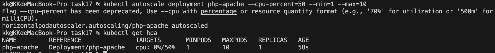
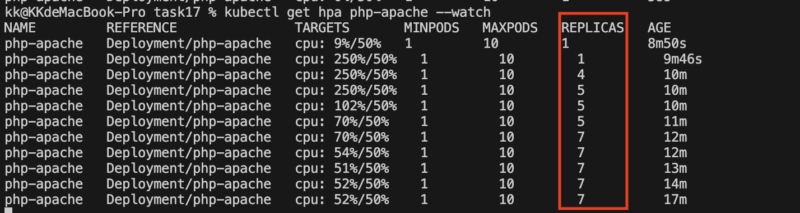
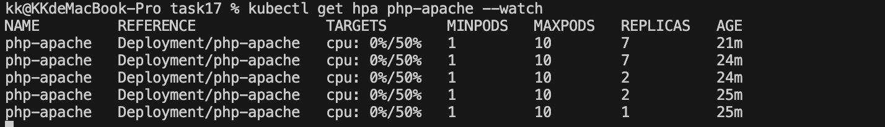

# 任務要求

https://kubernetes.io/zh-cn/docs/tasks/run-application/horizontal-pod-autoscale-walkthrough/#stop-load
跟據官方範例完成 HPA 的實作練習，至少需實作到『停止产生负载』即可。

# 實作回答

## 實作步驟

1. 開啟 Minikube 的 metrics-server
```bash
minikube addons enable metrics-server
```

2. 創建一個 deployment ```hpa-example.yaml```
```bash
kubectl apply -f hpa-example.yaml
kubectl get deployment php-apache
kubectl get svc php-apache
```
確定 deployment 跟 service 都順利部署

3. 建立 HorizontalPodAutoscaler
```bash
kubectl autoscale deployment php-apache --cpu=50% --min=1 --max=10
```



這個指令 kubectl autoscale 是在幫 php-apache 這個 Deployment 定義 HPA 規則，告訴 K8s：

- 最少保持 1 個 Pod
- 最多允許擴到 10 個 Pod
- 當平均 CPU 超過 50% 時，自動增加 Pod

這個規則建立後，HPA controller 會持續監控 CPU，之後你模擬負載，它才有依據去決定要不要擴縮容

4. 模擬負載
```bash
kubectl run -i --tty load-generator --rm --image=busybox:1.28 --restart=Never -- /bin/sh -c "while sleep 0.01; do wget -q -O- http://php-apache; done"
```

同時觀察 HPA 變化
```bash
kubectl get hpa php-apache --watch
```



5. 停止負載

在 load-generator 的終端機按 `Ctrl+C` 停止負載，接著觀察 HPA 縮容：

```bash
kubectl get hpa php-apache --watch
```

Pod 的數量逐漸減少


6. 實驗性設置進行刪除
```bash
kubectl delete hpa php-apache
kubectl delete deployment php-apache
kubectl delete svc php-apache
```